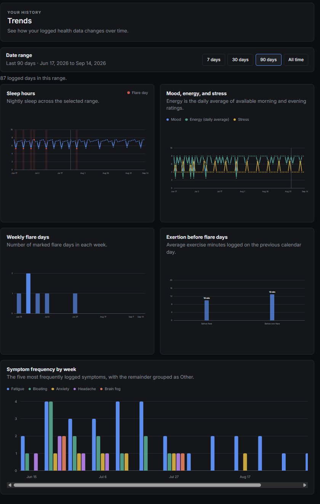
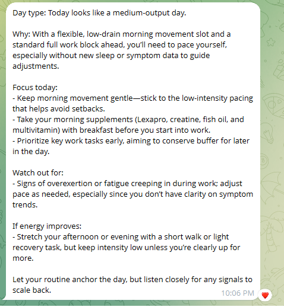
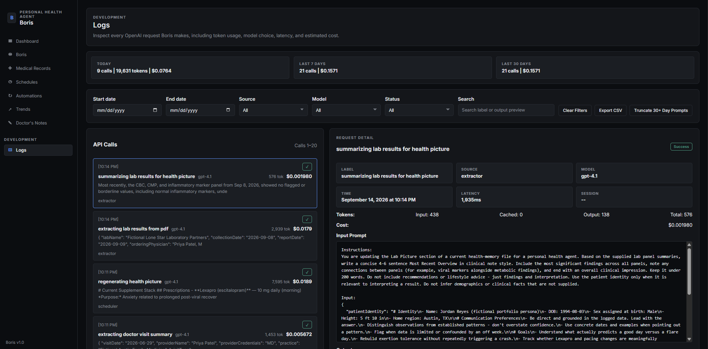
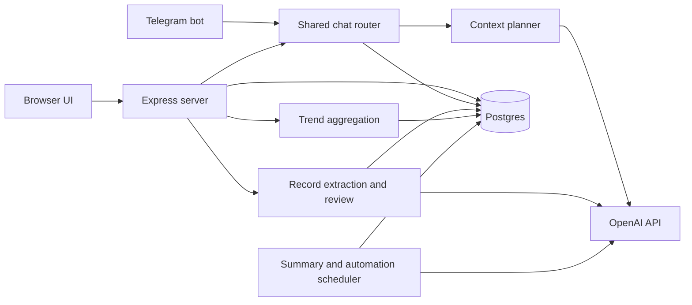

# Boris

[](https://github.com/Sawyerjones1/Boris/actions/workflows/ci.yml)

Boris is a single-user personal health agent that combines structured daily tracking, medical-record extraction, longitudinal summaries, and an AI chat interface. The same data and reasoning path power both the browser UI and an optional Telegram bot.

The project is designed to answer questions that a single long chat thread handles poorly: What changed before difficult days? Is a symptom becoming more frequent? Did a new routine coincide with a meaningful shift? Boris keeps the underlying data structured, compresses older history into summaries, and loads only the context needed for each response.

> Boris is a personal tracking and software demonstration project. It is not a medical device and does not diagnose conditions or replace professional medical advice.



<table>
<tr>
<td width="50%"></td>
<td width="50%"></td>
</tr>
<tr>
<td><em>A scheduled morning brief, generated from logged data and delivered over Telegram.</em></td>
<td><em>Every model call is recorded with tokens, latency, and estimated cost.</em></td>
</tr>
</table>

## Product tour

- **Daily dashboard:** Track sleep, energy, mood, stress, vitals, medications, supplements, symptoms, meals, hydration, exercise, flare days, and journal notes.
- **Boris chat:** Log information in plain language, ask questions in Doctor Mode, update profile memory, and create reminders conversationally.
- **Medical records:** Extract lab values from PDFs, summarize doctor notes from PDFs or pasted text, scan supplement labels, and maintain active prescriptions and supplements. Extracted data is editable before saving.
- **Schedules:** Model recurring work, exercise, appointments, and recovery blocks. Optionally display read-only Google Calendar events alongside them.
- **Automations:** Schedule one-time, multiple, or recurring Telegram reminders and health-aware morning briefs. Onboarding creates a default 9:00 AM morning brief.
- **Trends:** Explore sleep, weekly flares, mood/energy/stress, symptom frequency, and prior-day exertion across 7, 30, 90-day, or all-time ranges.
- **Doctor's Notes:** Review and edit Identity and Health Picture memory plus daily, weekly, monthly, quarterly, and yearly summaries.
- **API logs:** Inspect model inputs, outputs, token usage, latency, estimated cost, and failures with filtering, pagination, and CSV export.

Each main page includes a first-visit tutorial. Tutorial progress is stored per user in Postgres.

## Engineering highlights

- **Shared intent pipeline:** Web and Telegram messages use the same classifier and routing logic for logging, questions, profile updates, recap answers, and automation requests.
- **Tiered context loading:** Current questions use recent structured data; historical questions selectively add weekly, monthly, and quarterly summaries.
- **Hierarchical memory:** Scheduled jobs compress daily data into progressively larger summary periods and regenerate the current Health Picture from dated evidence.
- **Review before write:** Medical extraction produces an editable review step before structured records enter the database.
- **Observable AI calls:** OpenAI requests pass through one wrapper that records usage, cost, latency, source, and outcome.
- **Generic trend aggregation:** Charts discover user-defined symptoms at runtime and use the existing daily-log schema without persona-specific assumptions.
- **Deterministic demo:** A guarded seed script creates 120 days of fictional, internally consistent health data for portfolio demonstrations.



## Stack

| Area | Technology |
| --- | --- |
| Backend | Node.js 20+, Express 5 |
| Frontend | Plain HTML, CSS, JavaScript, and inline SVG charts |
| Database | Postgres, developed with Neon |
| AI | OpenAI API |
| Documents | `pdf-parse`, image inputs, structured extraction prompts |
| Scheduling | `node-cron` |
| Optional integrations | Telegram, Google Calendar, OpenWeather |
| Testing | Node's built-in test runner, GitHub Actions |

## Run locally

### Prerequisites

- Node.js 20 or newer
- A Postgres database. Any Postgres 14+ instance works, including a local one. Boris was developed against [Neon](https://neon.tech), whose free tier is enough to run the whole project.
- An OpenAI API key for AI-powered onboarding, chat, summaries, and extraction

### Setup

1. Clone the repository and install the locked dependencies:

   ```bash
   cd Boris
   npm ci
   ```

2. Copy the local configuration templates:

   ```bash
   cp .env.example .env
   cp config.json.example config.json
   ```

   On Windows PowerShell, use `Copy-Item` instead of `cp` if needed.

3. Set a local user ID in `config.json`:

   ```json
   {
     "userId": "local-user"
   }
   ```

4. Add the required values to `.env`:

   ```dotenv
   OPENAI_API_KEY=your_openai_key
   DATABASE_URL=your_postgres_connection_string
   ```

5. Start Boris:

   ```bash
   npm start
   ```

6. Open [http://localhost:3000](http://localhost:3000) and complete onboarding.

`initSchema()` creates and updates the database schema at startup. No separate migration command is required for a fresh installation.

## Fictional portfolio data

The seed script creates a fictional user, Jordan Reyes, with 120 days of post-viral recovery data. The story includes improving sleep and pacing, a switch from high-intensity exercise to lighter movement, changing flare frequency, and a medication timeline. The relationships are intentionally probabilistic so the charts and Doctor Mode have patterns to analyze without presenting a predetermined diagnosis.

Use a separate empty database for demo data. Set its connection string in `.env`, then set the following local user ID:

```json
{
  "userId": "portfolio-demo"
}
```

Seed the database:

```bash
npm run seed:demo
```

The script refuses to run unless `config.json` contains exactly `portfolio-demo`, and it deletes records only for that user ID. To clear that fictional user without reseeding:

```bash
npm run reset:demo
```

Set `DEMO_END_DATE=YYYY-MM-DD` in `.env` when you need stable dates across screenshots. Lab results and doctor visits are intentionally left empty so the upload and review workflow can be demonstrated with synthetic documents.

## Optional integrations

### Telegram

Create a bot through [BotFather](https://t.me/BotFather), then set both values:

```dotenv
TELEGRAM_BOT_TOKEN=
TELEGRAM_ALLOWED_CHAT_ID=
```

Send `/start` or `/id` to the bot to retrieve the chat ID. Boris rejects incoming Telegram messages until an allowed chat ID is configured. The Node process must remain running for polling, reminders, and briefs to work.

Two optional overrides are also recognized. `TELEGRAM_CHAT_ID` acts as a fallback when `TELEGRAM_ALLOWED_CHAT_ID` is not set, and `TELEGRAM_USER_ID` routes inbound Telegram messages to a specific user ID instead of the one in `config.json`. Neither is needed for a standard single-user setup.

### Google Calendar

Enable the Google Calendar API, create a Web application OAuth client, and add `http://localhost:3000/auth/google/callback` as an authorized redirect URI. Then set:

```dotenv
GOOGLE_CLIENT_ID=
GOOGLE_CLIENT_SECRET=
GOOGLE_REDIRECT_URI=http://localhost:3000/auth/google/callback
```

Calendar access is read-only. Boris stores the connection in Postgres and displays selected calendars alongside recurring blocks.

### Weather

Set an OpenWeather API key and coordinates to enable the dashboard weather card:

```dotenv
OPENWEATHERMAP_API_KEY=
WEATHER_LAT=
WEATHER_LON=
WEATHER_UNITS=imperial
```

## Tests

```bash
npm test
```

The test suite covers scheduling, automations, medical-record normalization, profile generation, API-log pagination and failures, tutorials, and trend aggregation. GitHub Actions runs the suite on pushes to `main` and on pull requests.

## Privacy and deployment

Boris intentionally targets one trusted user. The browser application and REST API do not include account authentication, authorization, CSRF protection, or multi-tenant isolation. Anyone who can reach the server can read and modify the configured user's data.

- Keep `.env` and `config.json` local; both are gitignored.
- Use a separate database for fictional demo data.
- Do not expose the Node server directly to the public internet.
- If hosting it remotely, put it behind access control such as a private network or authenticated reverse proxy.
- OpenAI request logs can contain health information because prompts and outputs are retained for observability. Use the truncation control on the Logs page when appropriate.
- Google credentials, Telegram credentials, and database credentials belong in environment variables, never tracked files.

For implementation details and known tradeoffs, see [CONTEXT.md](CONTEXT.md).

## License

No open-source license has been selected. The code is currently published for portfolio review with all rights reserved.
